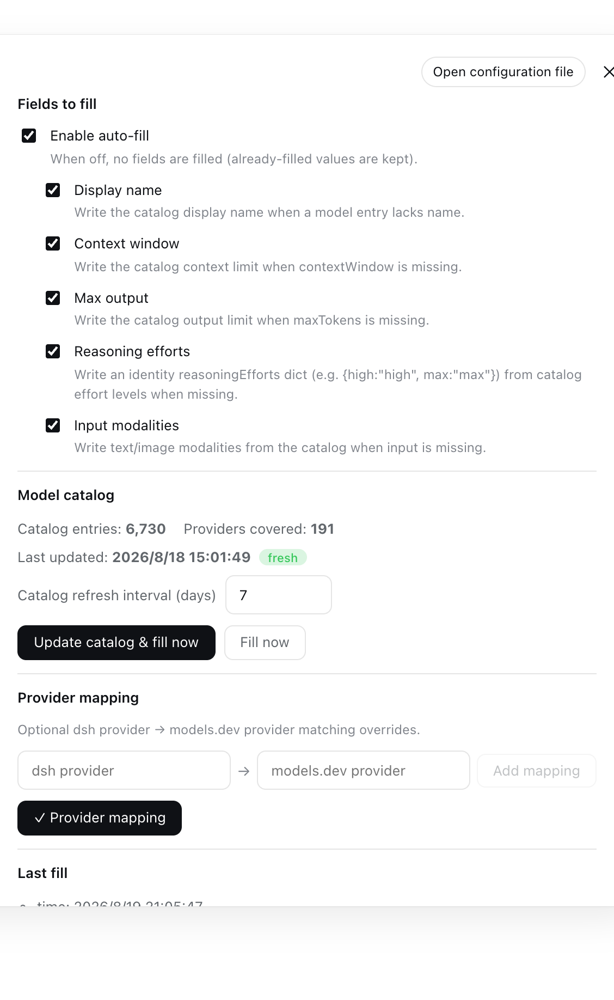

# dsh-model-parameters

[中文](README.md) | **English**

DSH plugin: when a provider's model sync (or any settings write) leaves model
entries with missing capability fields, automatically fill them from the
[models.dev](https://models.dev) catalog — display name, context window, max
output tokens, reasoning efforts, and input modalities.

Most provider `/v1/models` listings disclose an id and nothing else. This
plugin makes those synced models immediately usable by completing their
metadata from a locally cached catalog, and reports what it filled and what it
could not match.

## How it works

1. The plugin listens to the `llm-pi-ai` settings namespace (`settings/updated`).
   Any committed change — a freshly synced provider, an edited provider card, a
   manual `settings.yaml` edit — triggers a reconcile.
2. On plugin start it also runs one backfill over the existing configuration.
3. For every model entry missing any of `name` / `contextWindow` / `maxTokens` /
   `reasoningEfforts` / `input`, it resolves the best catalog entry and fills
   only the missing fields (fill-only: present values are never overwritten).
4. The write goes through the settings seam (`ctx.settings.mutate`), i.e. it
   lands in `~/.dsh/settings.yaml` — the same file you would edit by hand.

The reconcile is fill-only by construction, so its own writes cannot loop: the
next `settings/updated` sees the fields present and produces no ops.

## Matching

models.dev keys the same model under many providers (`deepseek-v4-flash`
appears under 57 providers). Resolution is deterministic and provider-aware:

1. **Provider match** — the models.dev provider mapped for the dsh provider
   (explicit `providerMap` override, then the same provider id). Your
   `opencode-go` route is also a models.dev provider, so its entries win.
2. **Exact full-id match** — a dsh model id already carrying a `vendor/` prefix
   matches the identical models.dev key.
3. **First-party vendor priority** — `officialProviders` (deepseek, openai,
   anthropic, google, xai, …) break collisions in favor of the vendor's own
   entry.
4. **Completeness** — entries with both limits known win over partial ones.
5. **Alphabetical provider id** — stable last resort.

Bare ids are matched case-insensitively against the last path segment, so
`qwen3.7-max` resolves `Qwen/Qwen3.7-Max` and `kimi-k2.7-code` resolves
`Kimi-K2.7-Code`.

## Filled fields

| dsh field | models.dev source | notes |
|---|---|---|
| `name` | `name` | display name |
| `contextWindow` | `limit.context` | tokens |
| `maxTokens` | `limit.output` | tokens |
| `reasoningEfforts` | `reasoning_options[type=effort].values` | identity dict `{high:"high", max:"max"}`; values outside pi-ai's levels (`default`/`none`/…) are filtered; `toggle`/`budget_tokens` options are ignored |
| `input` | `modalities.input` | filtered to `text`/`image` (the only modalities pi-ai accepts; `pdf`/`audio`/`video` are dropped) |

Models with no catalog match (e.g. a local gateway model like
`hy3-paid`) are left untouched and listed in the fill report as unmatched.

## Catalog caching & updates

- The catalog is fetched from `https://models.dev/api.json` and cached at
  `~/.dsh/model-parameters/catalog.json` (~4 MB).
- A cached catalog is refreshed lazily on the next reconcile once older than
  `ttlDays` (default **7 days**).
- A failed fetch keeps the last good cache; with no cache at all the plugin
  simply fills nothing until a refresh succeeds.
- The settings card has an **Update catalog & fill now** button for a forced
  refresh, and shows the last update time and freshness.

## Settings card

An expandable "模型参数补全 / Model Parameters" card appears in DSH
settings → **Plugins → Plugin configuration** (styled like the built-in plugin
cards, collapsed by default):



- master enable switch plus per-field toggles (`fillName`, `fillContext`,
  `fillMaxTokens`, `fillReasoning`, `fillInput`);
- catalog TTL in days;
- optional `provider → models.dev provider` mapping overrides;
- catalog freshness (entries, providers, last update);
- the last fill report: fields filled, providers touched, and the list of
  unmatched model ids.

Plugin configuration persists in the `model-parameters` settings namespace
(`~/.dsh/settings.yaml`), e.g.:

```yaml
model-parameters:
  enabled: true
  ttlDays: 7
  fillName: true
  fillContext: true
  fillMaxTokens: true
  fillReasoning: true
  fillInput: true
  providerMap: {}
  officialProviders:
    - deepseek
    - openai
    - anthropic
    - google
    - xai
```

## Installation

Install with the `dsh plugin` command (replace `web` with your profile name):

**From npm**:

```bash
dsh plugin --profile web add @fonlan/dsh-model-parameters
```

**Directly from GitHub**:

```bash
dsh plugin --profile web add github:fonlan/dsh-model-parameters
```

**Uninstall**:

```bash
dsh plugin --profile web remove @fonlan/dsh-model-parameters
```

## Development

```bash
pnpm install
pnpm build        # tsc types + tsdown host & client bundles
pnpm typecheck
node scripts/verify-catalog.mjs   # matching-logic check against a models.dev dump
```

## Release

Tagging auto-publishes to npm (GitHub Actions `Publish to npm` verifies the tag matches the package.json version, then runs `npm publish`; requires an `NPM_TOKEN` secret on the repo):

```bash
npm run release:patch   # npm version patch && git push && git push --tags
npm run release:minor
npm run release:major
```

## License

MIT
